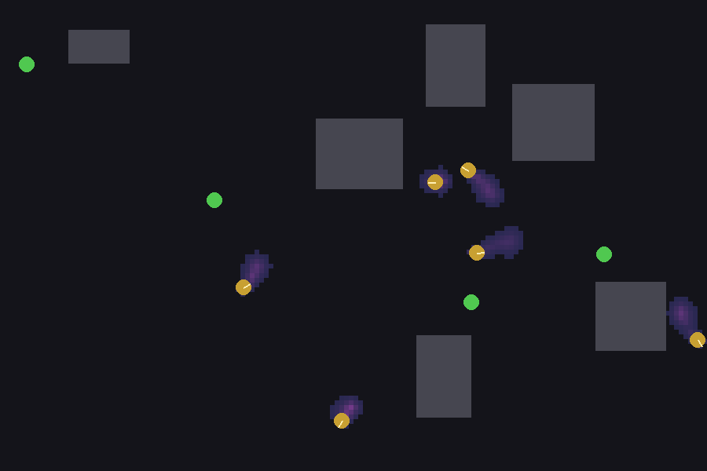
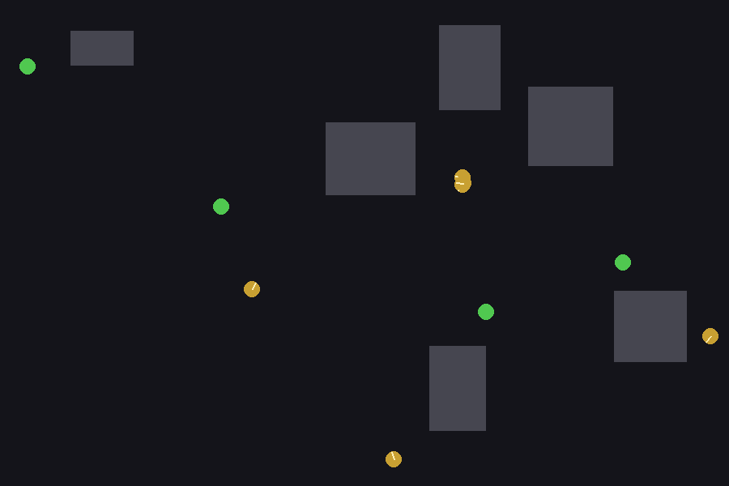
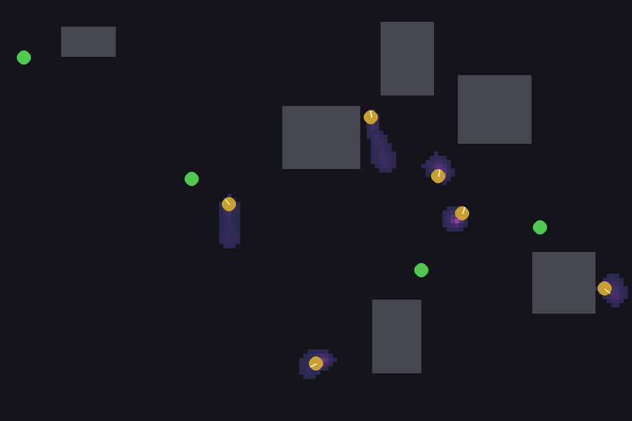
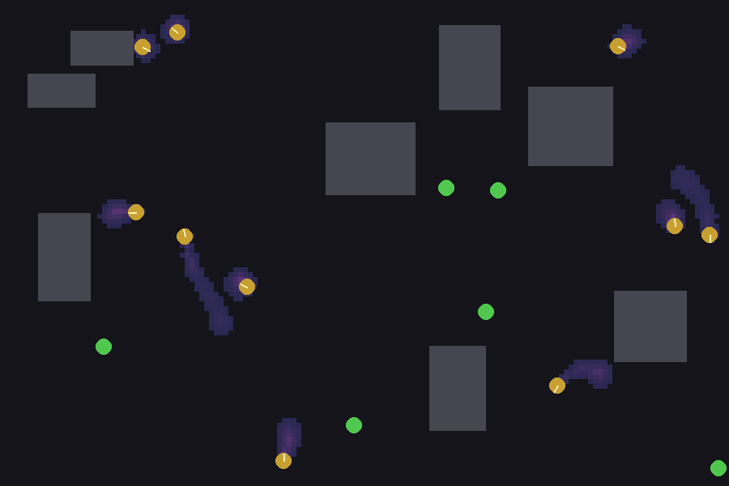

# Swarm RL PyGame Environment (Stigmergy)

A minimal multi-agent PyGame environment for swarm RL with pheromone stigmergy, plus random rollout and DQN training scripts.

## Screenshots






## Install

```bash
python -m venv .venv
source .venv/bin/activate
pip install pygame numpy torch
```

## Random rollout (rendered)

```bash
python train/random_rollout.py
```

## Train (headless)

```bash
python train/independent_dqn_pytorch.py --headless --total-steps 10000
```

Use a shared policy:

```bash
python train/independent_dqn_pytorch.py --shared-policy --headless
```

Save checkpoints during training:

```bash
python train/independent_dqn_pytorch.py --headless --save-every 2000 --save-dir checkpoints
```

## Demo (rendered)

```bash
python train/demo.py --checkpoint-dir checkpoints
```

Shared-policy demo:

```bash
python train/demo.py --checkpoint-dir checkpoints --shared-policy
```

## Environment API

`SwarmEnv` methods:
- `reset(seed=None) -> (obs, info)`
- `step(actions) -> (obs, rewards, terminated, truncated, info)`
- `render(mode="human", fps=60)`
- `close()`

### Actions
Discrete action space with 9 actions: `{throttle ∈ [-1,0,1]} × {turn ∈ [-1,0,1]}`.
Provide `actions` as a numpy array of shape `(n_agents,)` or `(n_agents, 1)` with values in `[0, 8]`.

### Observations
Each agent gets a local observation vector:
- 9 lidar rays (normalized)
- 2D relative vector to nearest target (agent frame, normalized)
- 2D relative vector to nearest agent (agent frame, normalized)
- heading as `sin(theta), cos(theta)`
- speed (normalized)
- pheromone samples in front of the agent (3 values, normalized)

Default `obs_dim` = 19.

### Stigmergy (pheromone)
The environment maintains a pheromone grid:
- deposit: each agent deposits per step
- decay: `pheromone *= 0.985`
- diffuse: simple neighbor averaging

Toggle pheromone cues in observation with `SwarmConfig.obs_include_pheromone`.

## Files
- `env/swarm_env.py` : environment implementation
- `env/config.py` : configuration dataclass
- `train/random_rollout.py` : random policy sanity check
- `train/independent_dqn_pytorch.py` : independent or shared DQN training
- `train/demo.py` : load and render trained checkpoints
- `docs/ARCHITECTURE.md` : detailed functionality and architecture

## Notes
- Episode ends when all targets are collected or `max_steps` reached.
- Dynamics are pluggable via `dynamics_mode`: `"tank"`, `"hover"`, or `"mixed"`.

## Beginner Walkthrough (PyGame + RL)

If you’re new to PyGame and RL, this section gives a quick mental model and a practical path to running the project.

### What this project does
- Simulates a swarm of agents in a 2D PyGame world.
- Exposes an RL-style API (`reset`, `step`) with multi-agent observations and rewards.
- Adds stigmergy via a pheromone grid that agents can sense.

### The fastest way to see it working
1) Random sanity check (renders a window):
```bash
python train/random_rollout.py
```

2) Train a basic model (headless, no window):
```bash
python train/independent_dqn_pytorch.py --headless --total-steps 10000 --save-dir checkpoints --save-every 2000
```

3) Run the demo with the trained model (renders a window):
```bash
python train/demo.py --checkpoint-dir checkpoints
```

### How the RL loop works (simple view)
Each step:
1) You give actions for each agent.
2) The environment moves agents, handles collisions, and collects targets.
3) You receive rewards + new observations.

### What the agents are learning
- **+8** when an agent reaches a target
- **-0.01** each step (encourages speed)
- **-0.2** for collisions with walls/obstacles

So the learned behavior should be: “find targets quickly without crashing.”

### How PyGame fits in
- PyGame is only used for rendering and window events.
- If you run with `--headless`, no window is opened and PyGame doesn’t render.

### Where to change behavior
- `env/config.py` controls most parameters:
  - number of agents/targets/obstacles
  - rewards
  - lidar rays
  - pheromone settings
  - dynamics mode (`tank`, `hover`, `mixed`)

### Want deeper details?
See `docs/ARCHITECTURE.md` for a full breakdown of modules and data flow.
