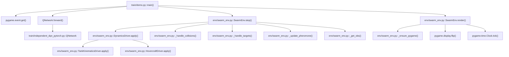
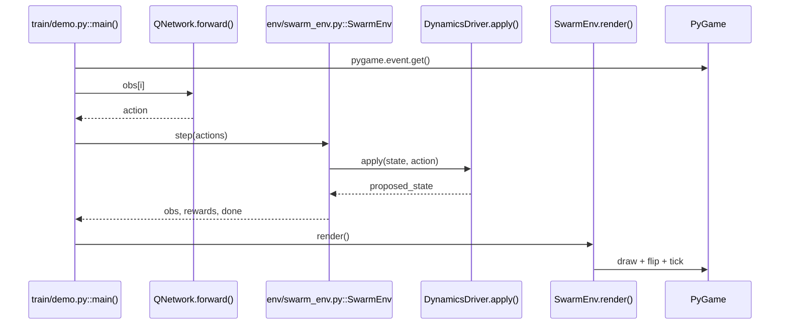
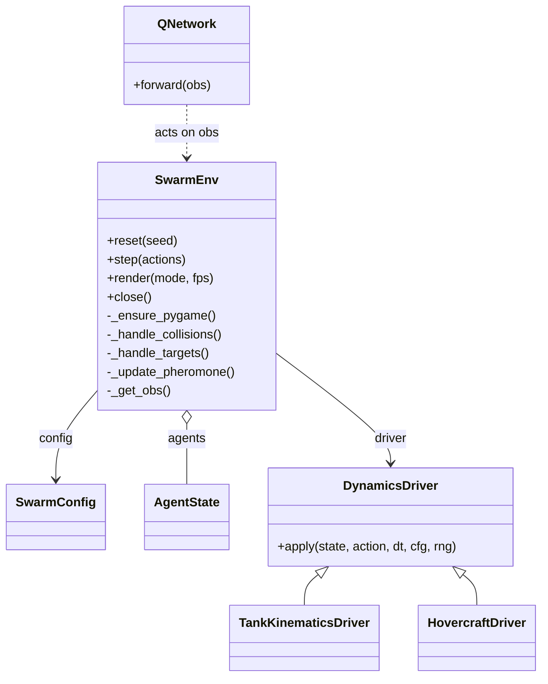
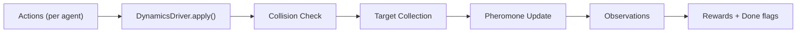
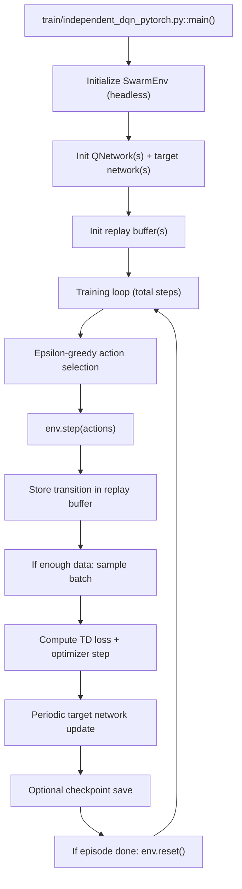
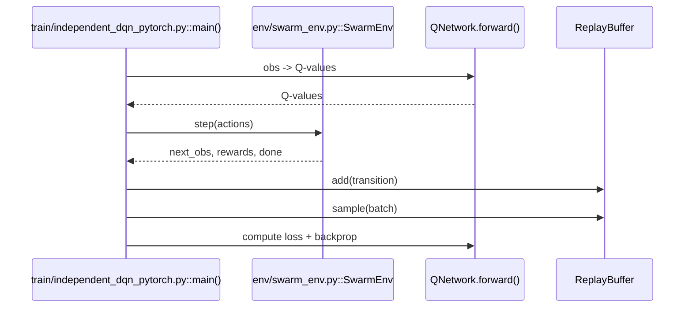

# UML Diagrams

This document provides Mermaid UML diagrams to explain how the system works at a high level.

## Call Flow (Demo Loop)

## Sequence Diagram (One Frame)

## Class Diagram (Core Runtime)

## State Update (RL Step)

## Training Flow (Independent DQN)

## Training Sequence (Single Step)

