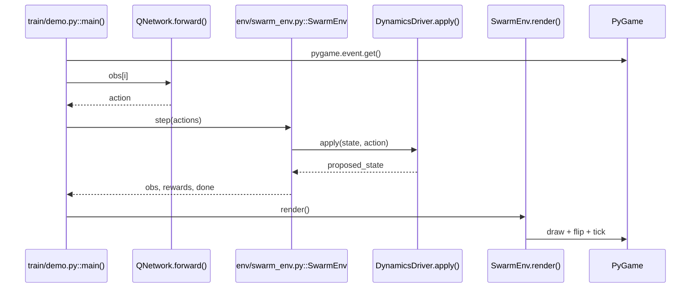
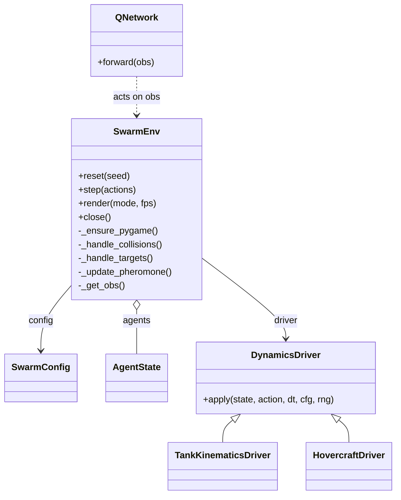
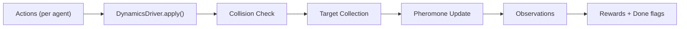

# UML Diagrams

This document provides Mermaid UML diagrams to explain how the system works at a high level.

## Call Flow (Demo Loop)

```mermaid
flowchart TD
  "train/demo.py::main()" --> "pygame.event.get()"
  "train/demo.py::main()" --> "QNetwork.forward()"
  "QNetwork.forward()" --> "train/independent_dqn_pytorch.py::QNetwork"

  "train/demo.py::main()" --> "env/swarm_env.py::SwarmEnv.step()"
  "env/swarm_env.py::SwarmEnv.step()" --> "env/swarm_env.py::DynamicsDriver.apply()"
  "env/swarm_env.py::DynamicsDriver.apply()" --> "env/swarm_env.py::TankKinematicsDriver.apply()"
  "env/swarm_env.py::DynamicsDriver.apply()" --> "env/swarm_env.py::HovercraftDriver.apply()"
  "env/swarm_env.py::SwarmEnv.step()" --> "env/swarm_env.py::_handle_collisions()"
  "env/swarm_env.py::SwarmEnv.step()" --> "env/swarm_env.py::_handle_targets()"
  "env/swarm_env.py::SwarmEnv.step()" --> "env/swarm_env.py::_update_pheromone()"
  "env/swarm_env.py::SwarmEnv.step()" --> "env/swarm_env.py::_get_obs()"

  "train/demo.py::main()" --> "env/swarm_env.py::SwarmEnv.render()"
  "env/swarm_env.py::SwarmEnv.render()" --> "env/swarm_env.py::_ensure_pygame()"
  "env/swarm_env.py::SwarmEnv.render()" --> "pygame.display.flip()"
  "env/swarm_env.py::SwarmEnv.render()" --> "pygame.time.Clock.tick()"
```

## Sequence Diagram (One Frame)



## Class Diagram (Core Runtime)



## State Update (RL Step)


